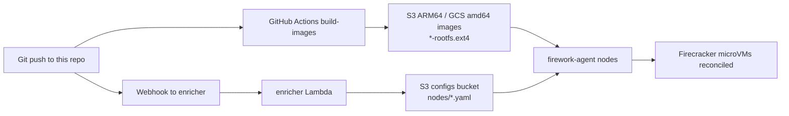

# firework-gitops-example

> This is an example deployment intended for demonstration and learning purposes only. It is not hardened, audited, etc.

Example GitOps repository for [Firework](https://github.com/artemnikitin/firework), focused on building Firecracker-ready rootfs images and publishing ARM64 images to S3 and amd64 images to GCS.

## Related Repositories

- [firework](https://github.com/artemnikitin/firework) - orchestrator runtime (`firework-agent`, `enricher`, `scheduler`)
- [firework-deployment-example](https://github.com/artemnikitin/firework-deployment-example) - Terraform + Packer deployment on AWS and GCP

## Configuration Docs

Service/config semantics are documented in the main `firework` repository:

- Configuration reference: <https://github.com/artemnikitin/firework/tree/main/docs/configs>
- Architecture details: <https://github.com/artemnikitin/firework/tree/main/docs/architecture>

This repository intentionally keeps only high-level pipeline guidance.

## End-to-End Flow



## CI Image Pipeline

The `build-images` workflow runs on every pull request and every push to `main`.
It builds the tenant rootfs images twice, once for `linux/arm64` and once for
`linux/amd64`, so a change fails CI if any declared `source_image` tag cannot be
exported for either architecture. The converter resolves the platform-specific
manifest digest with Docker buildx before creating the temporary container, so a
locally cached tag for another architecture cannot leak into the build. The
workflow installs CI dependencies, then delegates image work to the Makefile.
The Makefile is a thin entrypoint that calls the shell scripts in `scripts/`:

On pull requests, CI builds both architectures without cloud credentials. On
pushes to `main`, the ARM64 leg uploads to S3. The amd64 leg saves an artifact
for a separate main-only job that obtains a GCP token through Workload Identity
Federation and uploads to GCS. The shared build job has no OIDC permission.

1. `make build` calls `scripts/build-images.sh`.
2. `scripts/build-images.sh` resolves `fc-init` (release asset, `go install`,
   or bundled fallback build).
3. `scripts/build-images.sh` iterates over `tenants/*/*.yaml`.
4. `scripts/build-images.sh` reads `source_image` and optional `rootfs_size_mb`
   from each tenant file.
5. `scripts/build-images.sh` creates `<tenant>-<service>-rootfs.ext4` for the
   requested `TARGET_PLATFORM` via `scripts/docker-to-rootfs.sh`.
6. `scripts/build-images.sh` applies config overlays in order (shared baseline
   first, tenant-specific on top):
   - `configs/<service>/` (shared baseline, applied first if present)
   - `configs/<tenant>-<service>/` (tenant-specific, applied on top if present, overrides shared)
7. `make push` calls `scripts/push-images.sh`; `S3_IMAGES_BUCKET` selects S3 and
   `GCS_IMAGES_BUCKET` selects GCS.

## Public routing (provider-neutral)

A service requests a public route with `metadata.subdomain: <label>`, a single
DNS label. The deployed Firework agent supplies the DNS suffix (`ingress_domain`)
and forms the final hostname as `<subdomain>.<ingress_domain>`. One shared tenant
tree therefore serves every deployment:

| Service metadata | Deployment `ingress_domain` | Resolved hostname |
|---|---|---|
| `subdomain: tenant-1` | `artemnikitin.com` (AWS `domain_name`) | `tenant-1.artemnikitin.com` |
| `subdomain: tenant-1` | `gcp.artemnikitin.com` (GCP `base_domain`) | `tenant-1.gcp.artemnikitin.com` |

`metadata.subdomain` is exactly one label, because deployments provision a
single-label wildcard certificate (`*.<ingress_domain>`). An exact
`metadata.host` is still supported for custom or internal hosts, but the operator
then owns compatible DNS and TLS for that name. There is no provider-specific
config tree: GCP and AWS both consume the repository root, so do not set
`config_dir: gcp`.

This is unrelated to image upload routing: ARM64 images still go to S3 and amd64
images to GCS as described above.

### CI config validation

Before building images, the `validate-config` CI job runs Firework's
`cmd/configcheck --require-remote-routing` against this repository's root, using
the exact enricher of a pinned core version. Set the **required repository
variable `FIREWORK_CONFIG_REF`** to the `artemnikitin/firework` commit or tag that
matches the agent contract deployed to your nodes; pin it rather than tracking a
floating `main`, and bump it in lockstep when you roll a new node image. If the
`firework` repository is private, the job authenticates with the existing
`FIREWORK_GITHUB_TOKEN` secret. The job fails the build (before the expensive
image builds) when the runtime config is invalid.

The GCS upload job requires secrets `GCP_WORKLOAD_IDENTITY_PROVIDER`,
`GCP_SERVICE_ACCOUNT`, and `GCP_PROJECT_ID`, plus repository variable
`GCS_IMAGES_BUCKET`. Grant the CI service account object admin only on the amd64
images bucket and grant the repository principal Workload Identity User on the
service account.

Local platform-specific builds:

```bash
make build-arm64
make build-amd64
TARGET_PLATFORM=linux/amd64 make build
```

Local builds require Docker with buildx, `jq`, and `mkfs.ext4`.
