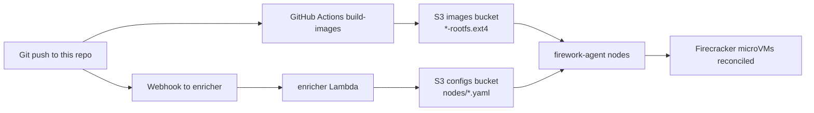

# firework-gitops-example

Example GitOps repository for [Firework](https://github.com/artemnikitin/firework), focused on building Firecracker-ready rootfs images from Docker images and publishing them to S3.

## Related Repositories

- [firework](https://github.com/artemnikitin/firework) - orchestrator runtime (`firework-agent`, `enricher`, `scheduler`)
- [firework-deployment-example](https://github.com/artemnikitin/firework-deployment-example) - Terraform + Packer deployment on AWS

## Configuration Docs

Service/config semantics are documented in the main `firework` repository:

- Configuration reference: <https://github.com/artemnikitin/firework/tree/main/docs/configs>
- Architecture details: <https://github.com/artemnikitin/firework/tree/main/docs/architecture>

This repository intentionally keeps only high-level pipeline guidance.

## End-to-End Flow

## CI Image Pipeline

The `build-images` workflow does the following on relevant pushes:

1. Resolves `fc-init` (release asset, `go install`, or bundled fallback build).
2. Iterates over `tenants/*/*.yaml`.
3. Reads `source_image` and optional `rootfs_size_mb` from each tenant file.
4. Builds `<tenant>-<service>-rootfs.ext4` via `scripts/docker-to-rootfs.sh`.
5. Applies config overlays with precedence:
   - `configs/<tenant>-<service>/` (tenant-specific)
   - then `configs/<service>/` (shared)
6. Uploads resulting `*-rootfs.ext4` artifacts to S3.
