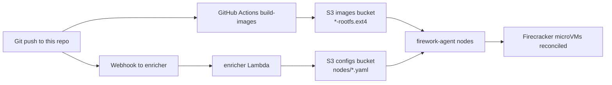

# firework-gitops-example

> This is an example deployment intended for demonstration and learning purposes only. It is not hardened, audited, etc.

Example GitOps repository for [Firework](https://github.com/artemnikitin/firework), focused on building Firecracker-ready rootfs images from Docker images and publishing them to S3.

## Related Repositories

- [firework](https://github.com/artemnikitin/firework) - orchestrator runtime (`firework-agent`, `enricher`, `scheduler`)
- [firework-deployment-example](https://github.com/artemnikitin/firework-deployment-example) - Terraform + Packer deployment on AWS

## Configuration Docs

Service/config semantics are documented in the main `firework` repository:

- Configuration reference: <https://github.com/artemnikitin/firework/tree/main/docs/configs>
- Architecture details: <https://github.com/artemnikitin/firework/tree/main/docs/architecture>

This repository intentionally keeps only high-level pipeline guidance.

## End-to-End Flow



## CI Image Pipeline

The `build-images` workflow runs on every pull request and every push to `main`.
It builds the tenant rootfs images twice, once for `linux/arm64` and once for
`linux/amd64`, so a change fails CI if any declared `source_image` tag cannot be
exported for either architecture. The converter resolves the platform-specific
manifest digest with Docker buildx before creating the temporary container, so a
locally cached tag for another architecture cannot leak into the build. The
workflow installs CI dependencies, then delegates image work to the Makefile.
The Makefile is a thin entrypoint that calls the shell scripts in `scripts/`:

On pull requests, CI runs `make build` only for both architectures. On pushes to
`main`, CI builds both architectures and uploads the existing ARM64 artifact
names with `make push`.

1. `make build` calls `scripts/build-images.sh`.
2. `scripts/build-images.sh` resolves `fc-init` (release asset, `go install`,
   or bundled fallback build).
3. `scripts/build-images.sh` iterates over `tenants/*/*.yaml`.
4. `scripts/build-images.sh` reads `source_image` and optional `rootfs_size_mb`
   from each tenant file.
5. `scripts/build-images.sh` creates `<tenant>-<service>-rootfs.ext4` for the
   requested `TARGET_PLATFORM` via `scripts/docker-to-rootfs.sh`.
6. `scripts/build-images.sh` applies config overlays in order (shared baseline
   first, tenant-specific on top):
   - `configs/<service>/` (shared baseline, applied first if present)
   - `configs/<tenant>-<service>/` (tenant-specific, applied on top if present, overrides shared)
7. `make push` calls `scripts/push-images.sh` to upload resulting
   `*-rootfs.ext4` artifacts to S3.

Local platform-specific builds:

```bash
make build-arm64
make build-amd64
TARGET_PLATFORM=linux/amd64 make build
```

Local builds require Docker with buildx, `jq`, and `mkfs.ext4`.
